## :wave: Hello, I'm Logic

**DevOps Engineer & Cloud Specialist**  
Passionate about infrastructure automation and cloud-native technologies.

### :globe_with_meridians: About Me
- :wrench: Experience with: Kubernetes, Bash/Go/Python, AliCloud/AWS/GCP
- :memo: Writing technical blogs and life records at [yakir.top](https://yakir.top/)
- :seedling: Currently learning: [Istio](https://istio.io/) and [Terraform](https://www.terraform.io/)

## :bar_chart: GitHub Metrics

  
Projects I created

  

  
📆 Commit calendar

  

## :hammer_and_wrench: Tech Stack

<!-- Badges List: https://github.com/alexandresanlim/Badges4-README.md-Profile -->
<!-- Badges Search: https://github.com/Aveek-Saha/GitHub-Profile-Badges -->

### :cloud: Cloud Platforms

### :computer: Operating Systems

### :gear: DevOps Tools

### :keyboard: Development

### :floppy_disk: Databases & Middleware

### :toolbox: Tools

### :page_facing_up: Formats

